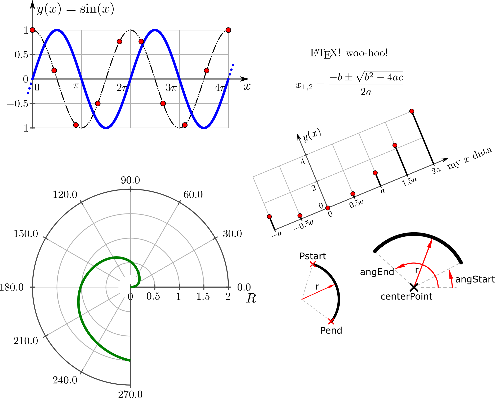

# inkscapeMadeEasy

This set of python modules is intended to extend Aaron Spike's inkex.py module <https://github.com/inkscape/inkscape/blob/bzr-original/share/extensions/inkex.py>, adding functions to help the development of new extensions for Inkscape <https://inkscape.org>.

Here you will find methods and classes to deal with drawings, styles, markers, texts, plots, etc. It is a work-in-progress project and new features will be added in the future. However there is no roadmap right now.

This project is not intended to provide an end-user Inkscape extension by itself but to provide easier backstage functions and classes to facilitate the development of Inkscape extensions.

For end-user extensions see my other projects on GitHub (more to come soon):

- **createMarkers**           <https://github.com/fsmMLK/inkscapeCreateMarkers>
- **cartesianAxes2D**         <https://github.com/fsmMLK/inkscapeCartesianAxes2D>
- **cartesianPlotFunction2D** <https://github.com/fsmMLK/inkscapeCartesianPlotFunction2D>
- **cartesianPlotData2D**     <https://github.com/fsmMLK/inkscapeCartesianPlotData2D>
- **cartesianStemPlot**       <https://github.com/fsmMLK/inkscapeCartesianStemPlot>
- **polarAxes2D**             <https://github.com/fsmMLK/inkscapePolarAxes2D>
- **logicGates**              <https://github.com/fsmMLK/inkscapeLogicGates>
- **circuitSymbols**          <https://github.com/fsmMLK/inkscapeCircuitSymbols>
- **dimensions**              <https://github.com/fsmMLK/inkscapeDimensions>

## History and Objectives

Historically this project started as a way to help myself while creating extensions, namely focusing on scientific/academic diagrams and graphs. In the academy, it is very common to prepare plots/diagrams to explain concepts during lectures, seminars or congresses.

There are many consecrated mathematical tools that can produce them, e.g., gnuplot, octave, matlab, R, etc. They all can produce nice plots, however it might be a little complicated if we want to add other elements to these plots, like texts, comments, arrows, etc. These packages have tools to do it but they are cumbersome to use. A better approach would be using a proper graphic software.

One possible approach is to export these plots as raster images and use a raster graphic software to produce the annotations, like Gimp. Personally, I prefer to have the plots in a vector graphic format to keep it aesthetically pleasing and add the annotations in a vector graphic software. For this, Inkscape is very sound.

Unfortunately, exporting the plots as vector graphics is not always successful in the sense that the resulting document is quite "dirty" (unorganized groups, isolated elements, etc.). Therefore I decided to make my own plotting/diagram tools for Inkscape.

In the process of creating these tools (I will upload them to GitHub in a near future) I realized that many of the low level classes and methods used to manipulate elements of the svg file could be grouped in a general purpose set of core modules that extended inkex.py module. **inkscapeMadeEasy** was born! The core modules I created do not intend to provide an extensive array of methods and classes to cover all possibilities of manipulations/transformations and drawing. These modules were born and expanded as I felt the necessity to have new methods to help my workflow. Nevertheless the number of methods created allows many possibilities and is still under development so new features can (will) appear in future versions.

**Obs:** Since it is not very easy to find documentation on other Inkscape modules, there might be other modules with similar/better features that I was not aware of when I was producing my extensions.

Enough mumbo-jumbo. Let's start! =D

# Documentation

You can find the main documentation page here <https://fsmmlk.github.io/inkscapeMadeEasy/>. I tried to make it useful to everyone by adding as many examples as possible. Check it out! =D

# Report issues

This is a work-in-progress project. Please report issues with the modules or documentation.
